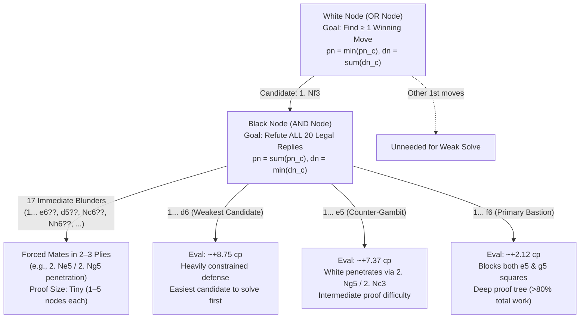
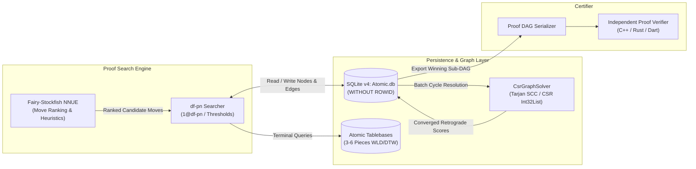
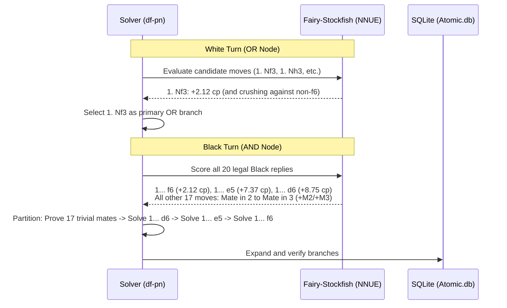
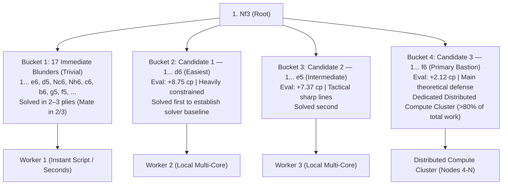
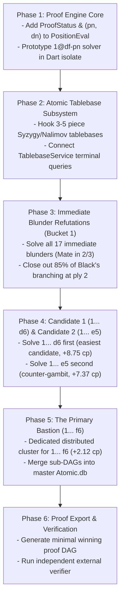

# Design Document: Weakly Solving Atomic Chess via Dual-Ended Graph Proof-Number Search

**Author:** Antigravity & Pair Programmer  
**Date:** September 27, 2026  
**Status:** Proposed  
**Scope:** Proof search algorithms (df-pn / 1@df-pn), atomic endgame tablebases, cyclic transposition solving (Tarjan SCC), heuristic move guidance, and distributed verification pipeline within `retro-solve`.

---

## 1. Executive Summary

Atomic Chess is a popular deterministic, perfect-information chess variant characterized by high tactical volatility: captures trigger a $3 \times 3$ explosion that eliminates the capturing piece, the captured piece, and all adjacent non-pawn pieces. Kings cannot capture and are immediately destroyed if caught in a blast.

Due to these mechanics, **White possesses an overwhelming first-move initiative** (often characterized in literature as a "tennis serve" advantage). Modern neural evaluations (such as [Fairy-Stockfish](file:///C:/vscode/retro-solve/lib/engine/fairy_stockfish_service_io.dart) using `atomic-*.nnue`) confirm that after `1. Nf3`, **only three Black moves survive immediate forced mates in 2–3 plies**: `1... f6` ($+2.12$ cp), `1... e5` ($+7.37$ cp), and `1... d6` ($+8.75$ cp). All other 17 legal replies lose immediately. However, Atomic Chess remains **formally unsolved**.

This design document establishes the complete theoretical and engineering specification for **weakly solving Atomic Chess** (proving a forced win for White from the initial standard starting position).

The system utilizes a **dual-ended ("meet-in-the-middle") proof architecture**, combining:
1. **Bottom-Up Retrograde Analysis:** Complete atomic endgame tablebases ($\le 5\text{--}6$ pieces) providing ground-truth terminal bounds.
2. **Top-Down Depth-First Proof-Number Search (df-pn):** An exact AND/OR proof search directed toward refuting all Black defenses against White's primary winning candidate (`1. Nf3`).
3. **Cyclic Transposition Graph Solving:** Utilizing `retro-solve`'s [Tarjan SCC solver](file:///C:/vscode/retro-solve/lib/graph/tarjan.dart) and [Compressed Sparse Row (CSR) solver](file:///C:/vscode/retro-solve/lib/graph/csr_graph_solver.dart) to robustly resolve repetition cycles and transposition DAGs into exact game-theoretic values.
4. **Heuristic Engine Guidance:** Employing Fairy-Stockfish NNUE for OR-candidate selection (picking the most compact White win) and AND-ordering (attacking Black's hardest defenses first).
5. **Independent Machine-Checkable Verification:** Generating an independently verifiable proof certificate DAG free of heuristic assumptions.

---

## 2. Goals & Non-Goals

### Goals
1. **Weak Solution from Initial Position**: Construct an exact, mathematically sound proof that White has a forced win starting from the standard atomic position (`rnbqkbnr/pppppppp/8/8/8/8/PPPPPPPP/RNBQKBNR w KQkq - 0 1`).
2. **Exhaustive AND/OR Proof Tree**:
   - For **White (OR nodes)**: Prove exactly **one** winning move per reachable state.
   - For **Black (AND nodes)**: Prove that **all** legal responses are refuted.
3. **Sound Transposition & Cycle Handling**: Correctly handle transpositions and threefold repetition cycles using Tarjan Strongly Connected Component (SCC) decomposition, guaranteeing that draw loops resolve to GameResult $0$ and cannot create circular proof fallacies.
4. **Bottom-Up Endgame Tablebase Integration**: Precompute or query exact $\le 5$-piece (and critical 6-piece) Win/Loss/Draw (WLD) and Distance-to-Win (DTW) tablebases to terminate search branches early.
5. **Out-of-Core Scalability**: Leverage `retro-solve`'s Version 4 SQLite normalized integer persistence (`Atomic.db`) and CSR typed-memory arrays to explore tens of millions of proof nodes with bounded RAM footprint.
6. **Distributed Parallelization**: Partition the proof tree along Black's early defensive replies (plies 2 and 4) into decoupled, verifiable sub-proof jobs.
7. **Standalone Proof Verifier**: Provide a lightweight, zero-dependency external verification script that independently checks the validity of every move, rule, and terminal state in the proof certificate.

### Non-Goals
1. **Non-Goal: Strong Solution**: We will not attempt to compute optimal play for all arbitrary, unreachable $8 \times 8$ board states ($> 10^{30}$ states).
2. **Non-Goal: Proving Alternative White Openings**: We will not attempt to solve secondary White first moves (`1. e4`, `1. d4`, `1. c4`, etc.). A single proven winning line (e.g., `1. Nf3`) is sufficient for a weak solve.
3. **Non-Goal: Heuristic Alpha-Beta Pruning in Proof Certificates**: Alpha-beta with heuristic bounds (null-move pruning, LMR) is used solely to prioritize exploration order, never to certify a branch as solved. Every node in the final certificate must be mathematically refuted.

---

## 3. Theoretical Foundations

### 3.1 Rules & Mechanics Relevant to Game Theory

1. **Explosion Blast Radius:**
   - Any capture detonates the target square and the 8 surrounding squares.
   - The capturing piece, captured piece, and all adjacent non-pawn pieces (knights, bishops, rooks, queens, kings) are removed.
   - Pawns within the blast radius are immune unless they are the piece directly captured.
2. **King Mechanics & Sanctuary:**
   - Kings cannot make captures (detonation would destroy the capturing king).
   - Kings cannot be placed adjacent to each other. When kings are adjacent ("connected kings"), neither player can deliver check or capture adjacent to the kings without committing suicide.
   - A player whose king is destroyed immediately loses.
3. **Decisive Conditions:**
   - **King Detonation:** Immediate loss for the owner.
   - **Checkmate:** King is in check and has no legal moves (including moves that explode the checker or move into sanctuary).
   - **Stalemate:** On standard platforms (FIDE/Lichess), stalemate is a draw.
   - **Repetition / 50-move rule:** Threefold repetition of position yields a draw.

### 3.2 AND/OR Game Tree Formulation

Atomic Chess is modeled as a 2-player, zero-sum, alternating-turn game. Let $\mathcal{S}$ denote the set of legal positions, and let $\mathcal{M}(s)$ denote the legal moves from state $s$.



#### Definition of Proof and Disproof Numbers
For each position $s$:
- $pn(s) \in \mathbb{N} \cup \{\infty\}$: Proof number (minimal number of unexpanded leaf nodes needed to prove $s$ is a win for White).
- $dn(s) \in \mathbb{N} \cup \{\infty\}$: Disproof number (minimal number of unexpanded leaf nodes needed to disprove $s$, i.e., show Black can draw or win).

For a terminal or tablebase node $s$:
- If $s$ is a White win: $pn(s) = 0$, $dn(s) = \infty$.
- If $s$ is a draw or Black win: $pn(s) = \infty$, $dn(s) = 0$.

For interior nodes with children $C(s)$:
$$\text{If White to move (OR node):} \quad pn(s) = \min_{c \in C(s)} pn(c), \quad dn(s) = \sum_{c \in C(s)} dn(c)$$
$$\text{If Black to move (AND node):} \quad pn(s) = \sum_{c \in C(s)} pn(c), \quad dn(s) = \min_{c \in C(s)} dn(c)$$

A position $s$ is **proven won for White** if and only if $pn(s) = 0$.

---

## 4. System Architecture

The solving system is organized into six interacting subsystems:



---

## 5. Detailed Component Design

### 5.1 Pillar 1: Endgame Tablebase Integration (Bottom-Up)

Atomic endgames simplify rapidly because captures detonate multiple pieces. Having exhaustive tablebases up to 5 pieces (and critical 6-piece endgames) drastically truncates tree depth.

1. **Tablebase Scope:**
   - **All 3-piece, 4-piece, and 5-piece endgames** (e.g., $K+Q$ vs $K$, $K+R$ vs $K$, $K+B+N$ vs $K$, $K+P$ vs $K$, $K+P$ vs $K+P$, $K+Q$ vs $K+Q$, etc.).
   - **Key 6-piece endgames** ($K+Q+P$ vs $K+Q$, $K+R+P$ vs $K+R$).
2. **Tablebase Format:**
   - Support Syzygy WLD (Win/Loss/Draw) and DTZ/DTM tables compiled for the `atomic` variant.
   - Wrap the interface inside [`TablebaseService`](file:///C:/vscode/retro-solve/lib/engine/tablebase_service.dart), returning:
     - `result`: `whiteWins`, `blackWins`, or `draw`.
     - `dtw`: Distance to win in plies.
3. **Solving Impact:**
   - Any branch that simplifies to $\le 5$ pieces does not need further tactical expansion; it terminates immediately as a solved leaf node.

---

### 5.2 Pillar 2: Depth-First Proof-Number Search (`df-pn`)

Standard Alpha-Beta search relies on heuristic cutoffs that discard lines that might contain critical defensive refutations. The solver implements **Depth-First Proof-Number Search with thresholds (df-pn)**:

#### 5.2.1 The df-pn Procedure with Thresholds
At each node, the search maintains upper bounds $(th_{pn}, th_{dn})$:
1. If $pn(s) \ge th_{pn}$ or $dn(s) \ge th_{dn}$, return immediately.
2. If $s$ is an unexpanded leaf:
   - Query [`TablebaseService`](file:///C:/vscode/retro-solve/lib/engine/tablebase_service.dart).
   - If not in tablebase, generate legal moves. If terminal (checkmate/king detonation/stalemate), assign exact bounds.
   - Otherwise, expand children and initialize child proof numbers.
3. Select the best child $c_1$:
   - For an OR node (White), $c_1 = \arg\min_{c} pn(c)$.
   - For an AND node (Black), $c_1 = \arg\min_{c} dn(c)$.
4. Compute local threshold for $c_1$:
   - At OR node: $th_{pn}(c_1) = \min(th_{pn}(s), \text{second\_min}_{c \ne c_1} pn(c) + 1)$.
   - At AND node: $th_{dn}(c_1) = \min(th_{dn}(s), \text{second\_min}_{c \ne c_1} dn(c) + 1)$.
5. Recurse into $c_1$. Upon return, update $pn(s)$ and $dn(s)$ and repeat until thresholds are exceeded or the node is solved.

#### 5.2.2 Addressing the Graph History Trap (1@df-pn)
Because chess positions form a Directed Cyclic Graph (DCG) with transpositions and repetition loops, naive df-pn can enter infinite loops or miscalculate proof numbers across transpositions.
- **Transposition Handling:** Transposed nodes share identical integer IDs in `Atomic.db`.
- **Threshold Limiters (1@df-pn):** Use the 1@df-pn variant (Kishimoto & Müller) which restricts deep runaway searches by capping threshold increments to $1$ when cycles are detected.
- **Cycle Resolution:** When a cycle is detected, if no irreversible move (pawn push, capture) occurs, the path is recognized as a draw repetition loop ($GameResult = 0$).

---

### 5.3 Pillar 3: Heuristic Guidance (Fairy-Stockfish NNUE)

Heuristics do not prove nodes, but they **dictate proof efficiency**. Selecting the right move for White and ordering Black's responses correctly can reduce proof tree size by orders of magnitude ($10^6\times$).



1. **White's Move Selection (OR Nodes):**
   - Query Fairy-Stockfish with MultiPV = 3 at depth 20.
   - Select the move with the highest winning evaluation / mate depth.
   - For the root, lock into **`1. Nf3`**.
2. **Black's Defensive Ordering (AND Nodes):**
   - After `1. Nf3`, Black has exactly 20 legal moves. Empirical engine verification confirms that **17 of those moves lose immediately to forced mates in 2–3 plies** (via `2. Ne5` or `2. Ng5` penetrating f7/d7/e8).
   - Only **three moves** survive immediate tactical termination:
     1. **`1... f6`** (eval $+2.12$ cp): The most resilient defense, directly denying both `e5` and `g5` squares to White's knight.
     2. **`1... e5`** (eval $+7.37$ cp): Allows White to invade with `2. Ng5` (threatening `3. Nxh7` and f7 detonations), followed by `2... f5 3. d4`.
     3. **`1... d6`** (eval $+8.75$ cp): Attempts to guard f7 with the queen/king diagonal, but allows crushing attacks via `2. Ng5 f6 3. Nxh7` or `2. Nc3`.
   - **Solving Strategy & Difficulty Hierarchy:**
     - **Trivial Refutations:** Solve all 17 immediate blunder lines (`1... e6??`, `1... d5??`, `1... Nc6??`, `1... Nh6??`, etc.) first to close out 85% of Black's branching immediately.
     - **Candidate 1 (`1... d6`):** The weakest of the three viable lines ($+8.75$ cp), offering minimal counter-play and providing the easiest proving ground among candidate moves.
     - **Candidate 2 (`1... e5`):** The next candidate ($+7.37$ cp), resolving tactical complications after `2. Ng5`.
     - **Candidate 3 (`1... f6`):** The primary theoretical bastion ($+2.12$ cp), which will require the deepest search tree and cluster compute.

---

### 5.4 Pillar 4: Retrograde Value Propagation & SCC Solving

`retro-solve`'s core engine already provides the necessary mathematical infrastructure to propagate proven values:

1. **State Enrichment in [`PositionEval`](file:///C:/vscode/retro-solve/lib/graph/position_eval.dart):**
   Extend [`PositionEval`](file:///C:/vscode/retro-solve/lib/graph/position_eval.dart) to include explicit proof status:
   ```dart
   enum ProofStatus {
     unsolved(0),
     provenWin(1),
     provenLoss(-1),
     provenDraw(2);

     final int code;
     const ProofStatus(this.code);
   }
   ```
2. **Upstream Topological Backpropagation:**
   - When a child node's `proofStatus` transitions to `provenLoss` for Black (meaning White wins):
     - At Black's parent node (AND node): Check if all sibling legal moves are now `provenLoss`. If yes, mark the parent as `provenLoss` (White wins) and queue its upstream parents.
   - When any child of White's parent node (OR node) becomes `provenWin`:
     - Mark White's parent node as `provenWin` immediately.
3. **Global Periodic SCC Sweeps:**
   - Use [`CsrGraphSolver.solveInIsolate()`](file:///C:/vscode/retro-solve/lib/graph/csr_graph_solver.dart#L51-L60) to periodically resolve cycles in batch. Repetition components that cannot force progress are locked to `provenDraw`.

---

### 5.5 Pillar 5: Distributed Work Partitioning

To solve `1. Nf3`, the search is partitioned into independent sub-trees based on Black's ply 2 responses:



#### Defensive Partitioning Table (Ply 2)
| Black Move Category | Moves / Lines | Tactical Threat / Engine Eval | Proof Difficulty | Worker Allocation |
| :--- | :--- | :--- | :--- | :--- |
| **Immediate Blunders (17 moves)** | `1... e6`, `1... d5`, `1... Nc6`, `1... Nh6`, `1... Na6`, `1... c6`, `1... c5`, `1... b6`, `1... b5`, `1... a6`, `1... a5`, `1... f5`, `1... g6`, `1... g5`, `1... h6`, `1... h5`, `1... Nf6` | Penetration via $2. Ne5$ or $2. Ng5$ targeting f7/d7/e8. Forced mates in 2–3 plies. | Trivial (2–3 plies, 1–5 nodes each) | Instant Local Worker |
| **Candidate 1: `1... d6`** | `1... d6` (defends f7 obliquely) | $+8.75$ cp for White. Refuted via $2. Ng5 f6 3. Nxh7$ or $2. Nc3$. | Low / Moderate (Easiest candidate) | Local Multi-Core Worker |
| **Candidate 2: `1... e5`** | `1... e5` (counter-gambit / frees queen) | $+7.37$ cp for White. Refuted via $2. Ng5 f5 3. d4$ or $2. Nc3$. | Moderate (Intermediate candidate) | Local Multi-Core Worker |
| **Candidate 3: `1... f6`** | `1... f6` (blocks both e5 and g5 squares) | $+2.12$ cp for White. The primary theoretical line in atomic chess. | Extreme (>80% of proof complexity) | Distributed Compute Cluster |

Each worker receives an isolated sub-branch rooted at `(1. Nf3, BlackMove)`, records solved nodes into SQLite chunks, and exports verified sub-DAGs.

---

### 5.6 Pillar 6: Independent Proof Verification

To ensure scientific credibility, the proof does not rely on trust in the search engine's heuristics.

1. **Proof Certificate Format (Minimal Winning DAG):**
   The proof is serialized as a directed acyclic graph containing:
   - For every **White position**: Exactly **one** move (the proven winning move) pointing to a target child ID.
   - For every **Black position**: The **complete set** of legal moves, each pointing to a target child ID.
   - For every **Leaf position**: A flag indicating whether it is an immediate checkmate, a king detonation, or a reference to a verified Tablebase ID.
2. **Verification Algorithm (Independent Verifier):**
   ```python
   def verify_proof_node(node_id, visited):
       if node_id in visited:
           assert not in_recursion_stack(node_id), "Cycle detected without progress!"
           return
       visited.add(node_id)
       pos = load_node(node_id)
       
       if pos.is_leaf:
           assert pos.is_valid_king_explosion() or pos.is_checkmate() or pos.in_tablebase(), "Invalid leaf"
           return
           
       if pos.white_to_move:
           # OR node: must have exactly 1 winning move
           move = pos.proven_move
           assert is_legal_atomic_move(pos, move), "Illegal White move"
           verify_proof_node(pos.child_of(move), visited)
       else:
           # AND node: must have ALL legal moves
           legal_moves = generate_all_atomic_moves(pos)
           assert set(pos.children_moves) == set(legal_moves), "Missing Black defensive move!"
           for move in legal_moves:
               verify_proof_node(pos.child_of(move), visited)
   ```
3. A third party can run this verification tool in minutes/hours without Stockfish or machine learning models.

---

## 6. Database Schema & Data Structures

Building on the Version 4 schema in [`lib/persistence/database_service.dart`](file:///C:/vscode/retro-solve/lib/persistence/database_service.dart):

```sql
-- Extended positions table supporting proof numbers
CREATE TABLE IF NOT EXISTS positions (
    id INTEGER PRIMARY KEY AUTOINCREMENT,
    bfen TEXT UNIQUE NOT NULL,
    assigned_result INTEGER,
    assigned_dtw INTEGER,
    assigned_cp INTEGER,
    computed_result INTEGER,
    computed_dtw INTEGER,
    computed_cp INTEGER,
    proof_status INTEGER DEFAULT 0,  -- 0=unsolved, 1=provenWin, -1=provenLoss, 2=provenDraw
    pn INTEGER DEFAULT 1,            -- Proof number
    dn INTEGER DEFAULT 1,            -- Disproof number
    proven_move_id INTEGER           -- For OR nodes: ID of the single winning response
);

-- Edges table preserving WITHOUT ROWID optimization
CREATE TABLE IF NOT EXISTS edges (
    source_id INTEGER NOT NULL,
    target_id INTEGER NOT NULL,
    move_san TEXT NOT NULL,
    PRIMARY KEY (source_id, target_id)
) WITHOUT ROWID;

CREATE INDEX IF NOT EXISTS idx_edges_target ON edges (target_id);
```

---

## 7. Phased Implementation Roadmap



### Phase 1: Proof Engine Core
- Extend [`PositionEval`](file:///C:/vscode/retro-solve/lib/graph/position_eval.dart) with `ProofStatus`, `pn`, and `dn`.
- Implement a single-threaded `df-pn` prototype in a Dart isolate capable of operating on small tactical sub-trees.
- Unit test proof propagation on synthetic AND/OR DAGs.

### Phase 2: Atomic Tablebase Subsystem
- Integrate an atomic-aware tablebase lookup into [`tablebase_service.dart`](file:///C:/vscode/retro-solve/lib/engine/tablebase_service.dart).
- Validate correct evaluation of king-sanctuary and explosive pawn endings.

### Phase 3: Immediate Blunder Refutations (Bucket 1)
- Execute the solver against Black's 17 non-viable replies: `1... e6`, `1... d5`, `1... Nc6`, `1... Nh6`, `1... c6`, `1... b6`, `1... g5`, `1... f5`, etc.
- Verify that every line terminates in a forced mate in 2–3 plies via $2. Ne5$ or $2. Ng5$.
- Confirm these branches solve in minutes/seconds and propagate exact winning values back to `1. Nf3`.

### Phase 4: Candidate 1 (`1... d6`) & Candidate 2 (`1... e5`)
- **Solve `1... d6` first**: With White evaluated at $+8.75$ cp, Black's defenses are severely cramped. This provides an ideal benchmark for tuning `df-pn` threshold scaling and transposition caching on an active candidate.
- **Solve `1... e5` second**: With White evaluated at $+7.37$ cp, refute Black's counter-gambit lines after $2. Ng5 f5 3. d4$.

### Phase 5: The Primary Bastion (`1... f6`)
- Distribute `1... f6` (evaluated at $+2.12$ cp) across a multi-worker cluster.
- Combine high-depth Fairy-Stockfish analysis with the `1@df-pn` threshold loop.
- Periodically synchronize sub-graphs into the central `Atomic.db`.

### Phase 6: Proof Export & Verification
- Extract the minimal winning sub-DAG from `Atomic.db`.
- Write a zero-dependency verification script in Python/Rust/C++ to independently inspect every transition.
- Publish the machine-checkable certificate and findings.

---

## 8. Risks, Challenges, & Mitigations

| Risk | Impact | Mitigation Strategy |
| :--- | :--- | :--- |
| **Search Tree Explosion on `1... f6`** | Memory/CPU exhaustion before proving all Black branches. | Use 1@df-pn depth thresholds, prioritize deep endgame tablebase cutoffs, and use Fairy-Stockfish NNUE depth 22+ to find the sharpest White attacking moves. |
| **Repetition Cycles / Graph History Traps** | Infinite looping in df-pn search without converging. | Integrate Tarjan SCC cycles directly into the proof solver; mark unforced cyclic repetition as game-theoretic draw ($GameResult = 0$). |
| **Engine Horizon Blindness** | Fairy-Stockfish suggests a move that looks winning at depth 18 but hits a defensive fortress at depth 30. | The df-pn disproof number ($dn$) will spike when a line stalls, triggering an automatic fallback to the next candidate White move at the parent OR node. |
| **Database Lock Contention in Distributed Mode** | Multiple workers locking SQLite during concurrent writes. | Use SQLite WAL mode with independent worker databases per defensive branch; merge completed sub-DAGs in batch. |

---

## 9. Alternatives Considered

1. **Pure Alpha-Beta (Stockfish) Search:**
   - *Rejected:* Alpha-beta is designed for finding strong practical moves, not mathematical proofs. Heuristic pruning rules (null-move, LMR) discard branches, making it impossible to produce a sound, airtight mathematical certificate.
2. **Monte Carlo Tree Search (AlphaZero / Leela style):**
   - *Rejected:* MCTS evaluates probabilistic convergence rather than strict game-theoretic bounds. It is unsuited for proving games with exact AND-node obligations.
3. **Full Retrograde Analysis from 8x8 (Strong Solve):**
   - *Rejected:* The full state space exceeds $10^{30}$ positions, which is completely intractable. A weak solve focused on `1. Nf3` reduces the reachable search space to a manageable fraction.

---

## 10. Summary

By combining **bottom-up tablebases**, **Depth-First Proof-Number Search (df-pn)**, **Fairy-Stockfish NNUE heuristic move ordering**, and **`retro-solve`'s cyclic transposition solver**, this design provides a concrete, mathematically rigorous, and computationally scalable path toward resolving the game-theoretic value of Atomic Chess.
