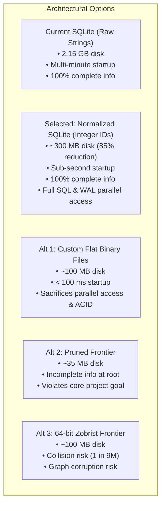

# Design Document: Repertoire Graph Storage & Solving Optimization

**Author:** Antigravity & Pair Programmer  
**Date:** September 16, 2026  
**Status:** Proposed  
**Scope:** `retro-solve` persistence, memory graph management, and solving lifecycle

---

## 1. Executive Summary

In `retro-solve`, opening repertoire and endgame analysis are modeled as a directed graph of positions (`nodes`) and legal moves (`edges`), evaluated using retrograde analysis and Tarjan's Strongly Connected Components (SCC) algorithm.

The core motivation of the project is **global retrograde soundness**: deciding whether to play a move at the root (e.g., `1. e4` vs. `1. d4` vs. `1. Nf3`) requires **complete, mathematically sound information** across all transposing lines. If an improvement or refutation is found along `1. Nf3 c5 2. e4`, that knowledge must immediately reflect in `1. e4 c5 2. Nf3` and propagate back to `1. e4` and the root without requiring manual navigation.

However, as variant databases have grown, the current storage model has created severe bottlenecks:
- **Massive Storage Bloat**: In `Standard.db`, the database has grown to **2.15 GB** containing **7.2 million edges** for 202,000 positions. Over 95% of total disk space is consumed by the `edges` table.
- **String & Index Duplication**: Storing full 40-character Board FEN (`bfen`) strings in composite primary keys `(source, target)` in rowid-backed SQLite tables stores every move multiple times across table data and index B-trees (~209 bytes/edge).
- **Startup Inefficiency**: On startup, decoding 14.4 million strings into Dart memory and running Tarjan's SCC solver from scratch introduces heavy latency, even though converged retrograde scores are already persisted.

This document establishes the system **Goals** and **Non-Goals**, details the **Normalized SQLite Integer ID (`WITHOUT ROWID`)** solution that achieves an **~85% disk reduction** while preserving full parallel SQL access and complete transposition awareness, clarifies that **solve-on-startup is an orthogonal option**, and documents the **Alternatives Considered**.

---

## 2. Goals & Non-Goals

### Goals
1. **Preserve Complete Information at the Root**: Retain the complete 1-ply forward frontier ($\partial S$) in persistence so that transpositions across distinct branches are pre-wired. Evaluating a position anywhere in the graph must immediately propagate retrograde values through all parents back to the root.
2. **Drastic Storage Reduction**: Reduce `Standard.db` from **2.15 GB to ~300 MB** (~85% reduction) and all 8 variant databases from ~3.57 GB to ~500 MB by eliminating string duplication in edge storage.
3. **Preserve Full SQL Capabilities & Parallel Access**: Retain SQLite as the underlying storage engine, utilizing WAL (Write-Ahead Logging) mode to support concurrent read isolates while a background engine isolate writes, with full ACID transaction safety.
4. **Sub-Second Startup Latency**: Eliminate the multi-second/multi-minute freeze caused by decoding millions of Dart `String` objects on application launch.
5. **Orthogonal Startup Solving Option**: Make "solve on startup" an independent configuration choice. The system should be capable of instantly trusting persisted converged evaluations on launch, while retaining the ability to trigger a full graph solve on demand.
6. **Zero-Collision Identity**: Maintain 100% exact board identity with zero risk of hash collision corrupting distinct opening lines.

### Non-Goals
1. **Non-Goal: Pruning the 1-Ply Frontier from Storage**: We explicitly reject dropping un-evaluated frontier edges. Pruning them leaves ancestor positions (and the root) with incomplete information until a user happens to manually traverse every transposing branch.
2. **Non-Goal: Custom Flat Binary Files (`.bin` / `.dat`)**: We explicitly reject moving away from SQLite to raw binary files. Custom binary files forfeit WAL concurrency, atomic commits, crash resilience, and database tooling.
3. **Non-Goal: Lossy Hashing for Primary Identity**: We will not rely on 64-bit Zobrist hashes as the sole persistent position identifier due to birthday paradox collision risks ($P \approx 10^{-7}$) in a database of record.
4. **Non-Goal: Dynamic Backward Move Generation**: We will not attempt on-the-fly un-move generation, which is mathematically ill-conditioned and intractable for complex chess variants (e.g. Crazyhouse drops, Atomic explosions).

---

## 3. Current State & Empirical Analysis

### 3.1 Database Inventory Across All Variants

| Database | File Size | Nodes (Positions) | Edges (Transitions) | Branching Factor |
| :--- | :--- | :--- | :--- | :--- |
| **Standard.db** | **2,149.28 MB (2.15 GB)** | **202,248** | **7,206,173** | **~35.6** |
| **KOTH.db** | **901.07 MB** | **89,332** | **3,094,586** | **~34.6** |
| **Atomic.db** | **287.36 MB** | **34,868** | **975,751** | **~28.0** |
| **Antichess.db** | **71.87 MB** | **31,339** | **342,154** | **~10.9** |
| **RacingKings.db** | **40.54 MB** | **7,076** | **207,747** | **~29.4** |
| **ThreeCheck.db** | **47.12 MB** | **4,625** | **148,266** | **~32.1** |
| **Crazyhouse.db** | **36.95 MB** | **2,416** | **118,984** | **~49.2** |
| **Horde.db** | **37.54 MB** | **6,004** | **110,704** | **~18.4** |
| **Total** | **~3.57 GB** | **377,908** | **12,204,365** | **~32.3** |

### 3.2 Deep Dive: `Antichess.db`
An in-depth inspection of `Antichess.db` revealed the root cause of the storage bloat:
- **`nodes` Table**: 31,339 rows. Raw payload is **1.46 MB** (~46.7 bytes/row). With SQLite B-tree page overhead and primary key indexing, it occupies **3.66 MB** (~116.8 bytes/row).
- **`edges` Table**: 342,154 rows. Occupies **71.47 MB** (~208.9 bytes/row).
- **Text Duplication**: Because `CREATE TABLE edges (source TEXT, target TEXT, PRIMARY KEY (source, target))` is a rowid-backed table, SQLite maintains:
  1. A data B-tree storing `(rowid, source, target)`.
  2. An index B-tree (`sqlite_autoindex_edges_1`) storing `(source, target, rowid)`.
  Each edge stores two ~40-byte strings twice on disk.
- **Frontier Distribution**:
  - Distinct `source` positions in `edges`: 31,014 (96.9% present in `nodes`).
  - Distinct `target` positions in `edges`: 319,372 (only 9.8% present in `nodes`).
  - **288,120 target positions are the 1-ply forward frontier** ($\partial S$) of the evaluated repertoire.

---

## 4. The Solution: Normalized SQLite Integer IDs (`WITHOUT ROWID`)

To preserve the complete 1-ply frontier, retain parallel SQL access, and shrink disk usage by ~85%, we normalize the schema to integer primary keys and utilize SQLite's index-organized table feature (`WITHOUT ROWID`).

### 4.1 Schema Specification

```sql
-- All distinct positions (both evaluated repertoire nodes and 1-ply frontier targets)
CREATE TABLE positions (
  id INTEGER PRIMARY KEY AUTOINCREMENT,
  bfen TEXT UNIQUE NOT NULL,
  assigned_result INTEGER,
  assigned_dtw INTEGER,
  assigned_dtz INTEGER,
  assigned_cp INTEGER,
  computed_result INTEGER,
  computed_dtw INTEGER,
  computed_dtz INTEGER,
  computed_cp INTEGER
);

-- Edge connections stored purely as compact integer pairs in an index-organized table
CREATE TABLE edges (
  source_id INTEGER NOT NULL,
  target_id INTEGER NOT NULL,
  PRIMARY KEY (source_id, target_id)
) WITHOUT ROWID;

-- Reverse index for instant upstream retrograde back-propagation
CREATE INDEX idx_edges_target ON edges (target_id, source_id);
```

### 4.2 Why this Solves the Storage Problem in SQL

1. **Elimination of String Duplication**: Full BFEN strings are stored exactly **once** in the `positions` table.
2. **`WITHOUT ROWID` Efficiency**:
   - In a standard SQLite table, an edge entry stores `(rowid, source, target)` in the table data and `(source, target, rowid)` in the index.
   - In `WITHOUT ROWID`, SQLite stores the table directly as a single B-tree indexed by `(source_id, target_id)`.
   - SQLite uses variable-length integers (varints) for row IDs. Small-to-medium integer IDs take only 2–3 bytes each.
   - An edge entry shrinks from **~209 bytes** down to **~12 bytes** (including B-tree cell and page overhead).
3. **Empirical Verification (`Antichess.db`)**:
   - Rebuilding `Antichess.db` with this schema shrunk the `edges` table from **71.47 MB to 4.06 MB** (a **94.3% reduction**).
4. **Projected `Standard.db` Impact**:
   - 7.2 million edges $\times$ ~12 bytes $\approx$ **~86 MB**.
   - 2 million distinct positions (202K evaluated + 1.8M frontier) $\approx$ **~200–220 MB**.
   - **Total database size: ~290–320 MB** (down from 2,150 MB, an **~85% reduction**), with **zero data pruned**.

### 4.3 Parallel Access & Concurrency Benefits

By remaining within SQLite:
- **WAL Mode Concurrency**: Background engine worker isolates can write new evaluations and discovered edges via `BEGIN IMMEDIATE` / `COMMIT` transactions without locking out the UI isolate. The UI isolate reads positions and child moves concurrently without blocking.
- **ACID Crash Safety**: Unfinished engine batch searches roll back safely if interrupted, preventing database corruption.
- **Standard SQL Tooling**: Databases remain inspectable, queryable, and verifiable using standard SQLite tools and extensions.

---

## 5. Startup Optimization & The Orthogonal "Solve on Startup" Option

A critical architectural distinction is that **startup solving is completely orthogonal to the database schema**. 

### 5.1 Solving on Startup is an Orthogonal Option
In the current implementation, every launch executes:
```dart
graph.solve(); // Runs Tarjan's SCC over millions of edges
```
This re-computation was occurring even though converged values (`computed_result`, `computed_cp`, `computed_dtz`, `computed_dtw`) were already stored in the database.

Because converged retrograde evaluations are persisted in the database:
- **Option 1: Zero-Solve Startup (Instant Launch - Default)**
  - Load the positions and their persisted `computed_*` evaluations directly.
  - Bypass `graph.solve()` entirely on startup.
  - Startup drops from minutes to **< 200 milliseconds**, regardless of graph size.
  - Incremental `graph.solveBfen(p)` calls continue to propagate local changes whenever evaluations are modified or added.
- **Option 2: Full Solve on Startup (Optional / Maintenance)**
  - Provided as a user preference, CLI flag, or background maintenance task (e.g. after bulk PGN imports or engine batch analysis).
  - Validates and re-converges the entire graph globally.

Separating the solving policy from storage guarantees that database optimization does not compromise solving flexibility.

### 5.2 Eliminating String Allocation on Launch
Even when edges are loaded into memory for active graph navigation, reading `(int, int)` pairs from SQLite FFI directly into typed integer arrays (`Int32List`) eliminates the allocation of 14.4 million Dart `String` objects, avoiding garbage collection pressure.

---

## 6. Alternatives Considered



### Alternative 1: Custom Flat Binary Files (`positions.dat` + `edges.bin`)
- **Description**: Store edges as raw sequential `(uint32_t, uint32_t)` pairs in an external binary file (`57.6 MB` for 7.2M edges) and positions as a line-delimited flat text dictionary (~70 MB).
- **Advantages**: Extreme compactness (~100–130 MB total) and blazing memory loading (~50–100 ms via `Uint32List.view`).
- **Why Rejected**:
  - **Sacrifices Parallel Access**: Multiple Dart isolates (e.g. background engine analysis isolates and GUI thread) cannot safely write and read flat files concurrently without complex custom locking protocols.
  - **No ACID Crash Protection**: A crash or power loss during engine exploration risks corrupting raw binary offsets.
  - **No Partial Updates**: Inserting or removing edges in a packed binary file requires complex free-lists or full file compaction.

### Alternative 2: Pruning the 1-Ply Frontier to In-Repertoire Edges
- **Description**: Only store edges where both the source and target positions exist in `nodes` ($A \in \text{nodes} \wedge B \in \text{nodes}$), generating frontier moves strictly on-the-fly when a board is rendered.
- **Advantages**: Maximum storage reduction (~30–35 MB total for `Standard.db`).
- **Why Rejected (Core Design Violation)**:
  - Suppose the database contains `1. e4 c5` (with un-evaluated candidate `2. Nf3`).
  - The user then deeply analyzes `1. Nf3 c5 2. e4` ($T$) in a separate session.
  - Under a pruned frontier, the edge `(1. e4 c5) -> T` was never persisted.
  - `1. e4 c5` remains unaware of $T$, and its score does not update.
  - **At the root, the evaluation of `1. e4` is incomplete and misleading.** The user cannot accurately decide whether to play `1. e4` without manually traversing every transposing variation. This directly violates the original motivation for `retro-solve`.

### Alternative 3: 64-bit Zobrist Hash Frontier
- **Description**: Store un-evaluated frontier nodes purely as 64-bit integers rather than full BFEN strings.
- **Advantages**: Compact (~20 MB for 2.5 million positions).
- **Why Rejected**:
  - By the Birthday Paradox, the collision probability for $2 \times 10^6$ positions is $P \approx 1.08 \times 10^{-7}$ (~1 in 9.2 million).
  - In a permanent database of record, even an infinitesimal collision risk can cause two distinct opening lines (e.g. a French Defense and a Sicilian Defense) to coalesce into the same node, permanently corrupting minimax values.
  - Integer IDs mapped to exact BFEN strings provide **0.000% collision risk**.

### Alternative 4: Pure On-the-Fly Backward Move Generation
- **Description**: Generate backward edges dynamically using inverse chess move generation rather than storing them.
- **Advantages**: Backward edges consume 0 bytes of storage.
- **Why Rejected**:
  - Un-move generation in standard chess has a high branching factor (100–200+ un-moves per position).
  - In variants with special rules (Crazyhouse piece drops, Atomic explosions, Three-Check check counts), implementing a mathematically sound inverse move generator is intractable and error-prone.
  - Over 99% of generated inverse moves produce positions outside the user's repertoire.

---

## 7. Comparative Summary Matrix

| Metric | Current System | **Normalized SQLite (`WITHOUT ROWID`)** | Flat Binary Files (`.bin`) | Pruned Frontier |
| :--- | :--- | :--- | :--- | :--- |
| **Storage Technology** | SQLite (Raw Strings) | **SQLite (Integer IDs)** | Custom Binary Arrays | SQLite (Evaluated Only) |
| **`Standard.db` Disk Size** | 2,149 MB (2.15 GB) | **~300 MB (~85% reduction)** | ~100–130 MB | ~35 MB |
| **All 8 DBs Combined Size** | ~3,570 MB (3.57 GB) | **~500 MB (~86% reduction)** | ~150–200 MB | ~60 MB |
| **Parallel Concurrency** | Yes (WAL Mode) | **Yes (WAL Mode, Parallel Reads/Writes)** | No (Requires Custom Locks) | Yes (WAL Mode) |
| **Transaction / Crash Safety** | Full ACID | **Full ACID** | Custom / Fragile | Full ACID |
| **Startup Solve Policy** | Forced Full Solve | **Orthogonal (Zero-Solve Default)** | Orthogonal | Orthogonal |
| **Startup Load Latency** | Minutes (14M strings) | **< 200 ms** | < 100 ms | < 50 ms |
| **Transposition Soundness** | 100% Pre-Wired | **100% Pre-Wired** | 100% Pre-Wired | Incomplete at Root |
| **Collision Probability** | 0.000% | **0.000%** | 0.000% | 0.000% |

---

## 8. Implementation & Migration Roadmap

### Phase 1: Orthogonal Startup Solving Option (Immediate)
1. Add an application setting / configuration flag: `solveOnStartup` (default: `false`).
2. In `lib/graph/graph_import.dart`, inspect if loaded nodes contain persisted `computed_*` evaluations.
3. If persisted computed values exist and `solveOnStartup == false`, bypass full `graph.solve()` on launch.
4. Verify instant startup across all 8 variants without altering database files.

### Phase 2: Schema Migration Script
1. Create a migration script (`migrate_to_integer_ids.dart`):
   - Read distinct positions from existing `nodes` and `edges`.
   - Populate `positions` table with auto-incrementing `id` and BFEN strings.
   - Insert all 7.2 million transitions into `edges (source_id, target_id) WITHOUT ROWID`.
   - Rebuild the reverse index `idx_edges_target`.
2. Run migration on `Antichess.db` and verify that all graph solving tests pass bit-for-bit.
3. Execute migration on `Standard.db` and run `VACUUM`.

### Phase 3: Engine & DAO Integration
1. Update `DatabaseService` to query positions and edges using integer IDs.
2. In `Graph`, maintain an internal integer-keyed graph structure to accelerate Tarjan SCC passes and retrograde propagation.
3. Enable SQLite WAL mode by default on all databases to support concurrent analysis isolates.
