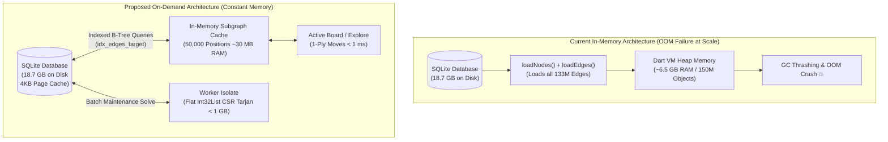
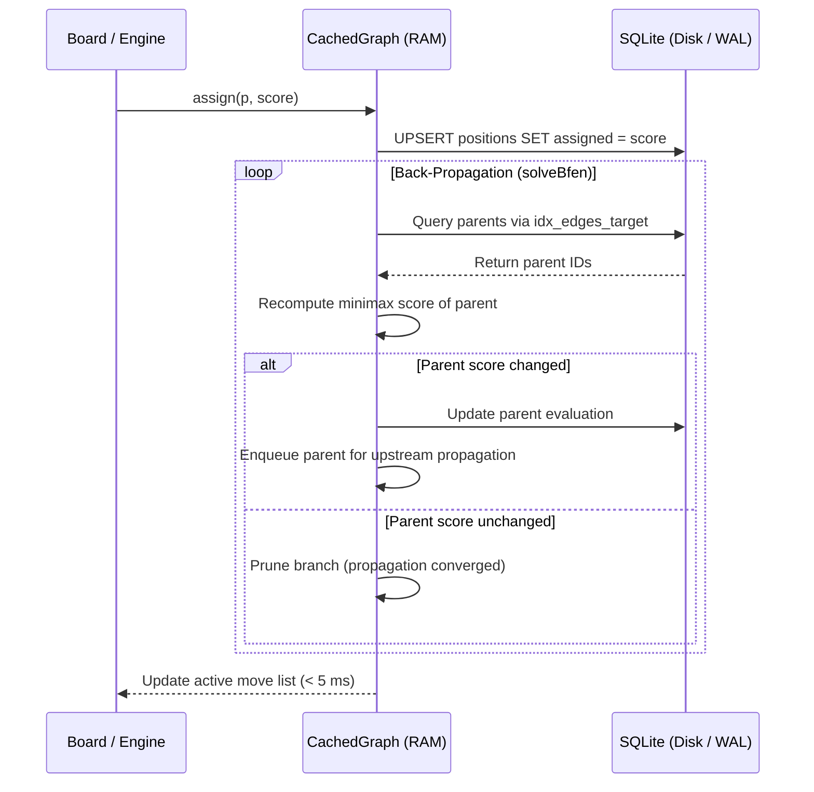

# Design Document: On-Demand Graph Architecture & Out-of-Core Scaling

**Author:** Antigravity & Pair Programmer  
**Date:** September 17, 2026  
**Status:** Proposed  
**Scope:** `retro-solve` in-memory graph management, paging lifecycle, localized retrograde propagation, and out-of-core scaling.

---

## 1. Executive Summary

With the successful deployment of **Version 4 Normalized Storage** (`positions` table with integer IDs and `edges (source_id, target_id) WITHOUT ROWID`), `retro-solve` reduced active database storage by **~45.4% (saving 1.66 GB)** across all 8 variants while preserving 100% of the 1-ply forward frontier ($\partial S$).

However, as variant repertoires scale into production-grade depths (e.g., adding **12.24 million evaluated positions** in Antichess), the graph expands to **~130 million transitions and ~100–115 million positions**, pushing the on-disk database to **~18–20 GB**.

Under the current architecture, `retro-solve` loads the **entire database into Dart heap memory (`graph.v`) on startup**. At 12.24M positions:
- Storing millions of `Vertex` objects, string keys, and `Set<String>` edge collections requires **~6 to 8 GB of RAM**.
- Garbage collection (GC) pauses over 150+ million heap objects cause severe UI freezes.
- Running Tarjan's Strongly Connected Components (SCC) solver in memory demands gigabytes of auxiliary state, risking out-of-memory (OOM) crashes on standard user machines.

This document presents the **On-Demand Graph Architecture**:
1. **SQLite as the Out-of-Core Graph Engine**: SQLite manages the 20 GB+ database on disk using constant-memory 4 KB page caching.
2. **Bounded LRU In-Memory Subgraph Cache**: The UI and engine interact with a bounded cache of recently accessed positions (e.g., 50,000 positions $\approx$ **~30 MB RAM**), querying SQLite on demand in **< 1 millisecond**.
3. **Targeted Upstream Retrograde Propagation**: During live play and automated exploration, score updates propagate backward through ancestors along the `idx_edges_target` index using `solveBfen()` in milliseconds without global re-solving.
4. **Out-of-Core Flat Typed Array Solver (`Int32List` CSR)**: For global maintenance re-solves, Tarjan's SCC runs in a background isolate using contiguous flat integer memory buffers (Compressed Sparse Row), solving 130 million edges in **< 1 GB of RAM in ~5–10 seconds** with zero GC overhead.

---

## 2. Goals & Non-Goals

### Goals
1. **Constant Low-Memory Footprint (< 150 MB RAM)**: Ensure application RAM consumption remains bounded and small regardless of database size (whether 50 MB, 2 GB, 20 GB, or 100 GB).
2. **Instant Startup (< 50 ms)**: Eliminate startup parsing of millions of nodes and edges. Launching the app requires only opening the SQLite connection and loading the root board state.
3. **Sub-Millisecond Interactive Navigation**: Fetching a position's 1-ply moves, evaluations, and backward links from SQLite must complete in **< 1 millisecond** on standard solid-state storage.
4. **Sound Localized Retrograde Back-Propagation**: Score modifications during exploration or manual editing must immediately propagate retrograde values through all ancestor positions using SQLite reverse indexing (`idx_edges_target`) in **< 5 milliseconds**.
5. **Preserve 100% Global Solving Capability**: Retain the ability to run a global Tarjan SCC convergence over 100M+ edges using flat typed memory (`Int32List`) in a background isolate without crashing or freezing the UI.
6. **Zero Data Loss & Zero Frontier Pruning**: Maintain complete mathematical soundness across transpositions by preserving the full 1-ply frontier ($\partial S$) on disk.

### Non-Goals
1. **Non-Goal: Replacing SQLite with Custom Binary Files**: We explicitly reject custom binary graph files (`.bin` / `.dat`). SQLite with WAL mode provides battle-tested ACID transactions, page caching, crash resilience, and multi-isolate concurrency.
2. **Non-Goal: Discarding the 1-Ply Frontier ($\partial S$)**: We will not prune un-evaluated frontier positions from disk. Dropping them corrupts root retrograde soundness across alternative move orders.
3. **Non-Goal: Replacing Tarjan with Heuristic Minimax**: Cyclic positions (threefold repetitions and recurring maneuvers) require exact strongly connected component contraction for game-theoretic correctness.

---

## 3. Background & Problem Statement

### 3.1 Scaling to 12.24M Evaluated Positions
In Antichess, mandatory captures yield an empirical branching factor of $b \approx 10.85$. Scaling the evaluated repertoire to **12.24 million positions** produces:
- **Evaluated Repertoire ($S$):** 12,240,000 positions.
- **Total Forward Transitions ($|E|$):** $12.24\text{M} \times 10.85 \approx \mathbf{132.8\text{ million edges}}$.
- **Internal Repertoire Transitions:** ~20–25 million edges.
- **Frontier Transitions ($S \to \partial S$):** ~105–110 million edges.
- **Unique Frontier Positions ($\partial S$):** Factoring in ~15% transposition convergence, ~90–100 million distinct board states.
- **Total Database Positions ($|V|$):** **~105 to 115 million positions**.

### 3.2 Disk vs. RAM Asymmetry
- **On Disk (SQLite v4 Schema):**
  - `edges` table (`WITHOUT ROWID`) + `idx_edges_target`: $133\text{M} \times \sim 30\text{ bytes} \approx \mathbf{3.9\text{ GB}}$.
  - `positions` table + `positions(bfen)` unique index: $110\text{M} \times \sim 135\text{ bytes} \approx \mathbf{14.8\text{ GB}}$.
  - **Total Disk Footprint:** **~18.7 GB**. SQLite handles this seamlessly using its internal 4 KB page cache.
- **In Memory (Current Dart Implementation):**
  - Storing 12.24M `Vertex` objects: ~880 MB.
  - Storing 12.24M BFEN `String` instances: ~780 MB.
  - Storing 133M edge references in 24.5M `Set<String>` collections: ~3.25 GB.
  - `Map<String, Vertex>` table overhead: ~350 MB.
  - **Total Heap Allocation:** **~5.3 to 6.5 GB**.
  - **GC & Runtime Failure:** Managing 150+ million distinct heap objects triggers catastrophic GC thrashing and crashes machines with 8 GB or 16 GB of RAM.



---

## 4. The Solution: On-Demand Graph Architecture

### 4.1 Tier 1: In-Memory Bounded Subgraph Cache (`CachedGraph`)

Instead of storing the universe in `graph.v`, the memory model transitions to a bounded **Least Recently Used (LRU) Subgraph Cache**:

```dart
class CachedGraph {
  static const int defaultCapacity = 50000;
  final int capacity;
  
  // LRU linked hash map tracking active vertices
  final LinkedHashMap<String, Vertex> _cache = LinkedHashMap();
  
  CachedGraph({this.capacity = defaultCapacity});

  Future<Vertex?> getVertex(String bfen) async {
    if (_cache.containsKey(bfen)) {
      // Re-insert to mark as most recently used
      final v = _cache.remove(bfen)!;
      _cache[bfen] = v;
      return v;
    }
    
    // Cache miss: fetch position and its 1-ply edges from SQLite
    final v = await _loadVertexFromDatabase(bfen);
    if (v != null) {
      _putVertex(bfen, v);
    }
    return v;
  }

  void _putVertex(String bfen, Vertex v) {
    if (_cache.length >= capacity) {
      final oldestKey = _cache.keys.first;
      final oldestVertex = _cache.remove(oldestKey)!;
      if (oldestVertex.isDirty) {
        DatabaseService.instance.flushVertex(oldestVertex);
      }
    }
    _cache[bfen] = v;
  }
}
```

### 4.2 Tier 2: Sub-Millisecond SQLite Neighborhood Queries

When a position is loaded or navigated to, the cache populates its local neighborhood via three indexed SQL queries:

1. **Position Evaluation:**
   ```sql
   SELECT id, assigned_result, assigned_dtw, assigned_cp,
          computed_result, computed_dtw, computed_cp
   FROM positions WHERE bfen = ? LIMIT 1;
   ```
   *Execution Time:* **~0.05 ms** (indexed binary search in `positions(bfen)`).

2. **Forward Legal Moves (Child Edges):**
   ```sql
   SELECT p.bfen, p.assigned_result, p.computed_result
   FROM edges e
   JOIN positions p ON e.target_id = p.id
   WHERE e.source_id = ?;
   ```
   *Execution Time:* **~0.2 ms** (index range scan on `edges (source_id, target_id)`).

3. **Incoming Ancestor Moves (Reverse Edges for Back-Propagation):**
   ```sql
   SELECT p.bfen, p.id
   FROM edges e
   JOIN positions p ON e.source_id = p.id
   WHERE e.target_id = ?;
   ```
   *Execution Time:* **~0.2 ms** (index range scan on `idx_edges_target (target_id, source_id)`).

Total time to load a position and all surrounding connections: **< 0.5 ms**.

---

### 4.3 Tier 3: Localized Retrograde Back-Propagation (`solveBfen`)

During manual analysis or automated `explore`, assigning an evaluation to a position $p$ does not require re-solving millions of unrelated branches. Evaluations only propagate backwards through **ancestors**:



1. Position $p$ is assigned an evaluation.
2. Parent positions are fetched via `idx_edges_target`.
3. For each parent, compute its optimal minimax evaluation based on all its children.
4. If the parent's evaluation changes, update it in SQLite and recursively enqueue the parent's ancestors.
5. If the parent's evaluation does not change, propagation along that branch halts immediately.

*Performance:* Touches only the **10–50 positions** along the active transposing branches. Completes in **1 to 5 milliseconds**.

---

### 4.4 Tier 4: Out-of-Core Global Tarjan Solving via Flat Typed Memory (`Int32List` CSR)

When a user initiates a full graph re-solve (e.g. after bulk PGN import), solving must not allocate millions of Dart heap objects. 

Because schema v4 assigned every position a 32-bit integer ID (`1` to $N$), the entire graph is converted into **Compressed Sparse Row (CSR)** format in a **background Dart worker isolate**:

```dart
class CsrGraphSolver {
  // Continuous typed arrays (Zero Dart heap object overhead)
  late Int32List rowOffsets;  // Size: N + 1 (49 MB)
  late Int32List colIndices;  // Size: E (532 MB)
  
  late Int32List indices;     // Size: N (49 MB)
  late Int32List lowlinks;    // Size: N (49 MB)
  late Int32List stack;       // Size: N (49 MB)
  late Uint8List onStack;     // Size: N (12 MB)
  late Int32List dfsStack;    // Size: 2 * N (98 MB)

  void runTarjan() {
    // Non-recursive iterative DFS traversal over integer buffers
    // Visits all 133M edges with contiguous CPU L1/L2 cache streaming
  }
}
```

#### Memory Footprint During 133M-Edge Global Solve:
$$\text{CSR Graph Structure (581 MB)} + \text{Tarjan State (257 MB)} \approx \mathbf{838\text{ MB RAM}}$$

#### Solving Lifecycle:
1. Isolate opens read-only connection to SQLite in WAL mode (UI remains responsive).
2. Streams integer pairs `(source_id, target_id)` into `rowOffsets` and `colIndices`.
3. Executes non-recursive Tarjan DFS across continuous byte buffers.
4. Processes discovered SCCs in reverse topological order (leaves to root), computing exact retrograde game-theoretic values.
5. Writes updated evaluations back to `positions` in a single batched transaction.
6. Deallocates the typed arrays. Process RAM drops back to **< 100 MB**.

*Total Runtime:* **~5 to 10 seconds** for 133 million transitions.

---

## 5. Alternatives Considered

| Approach | Memory at 12.24M Nodes | Latency | Viability | Reason for Rejection |
| :--- | :---: | :---: | :---: | :--- |
| **1. Full In-Memory Graph (Current)** | ~6.5 to 8.0 GB | Fast after minutes of loading | **Fails** | OOM crashes on 8 GB / 16 GB machines; massive GC freezes. |
| **2. Prune Frontier Edges ($\partial S$)** | ~1.2 GB | Instant | **Fails** | **Corrupts root correctness**. Transpositions into unvisited lines are lost. |
| **3. Memory-Mapped Binary File (`mmap`)** | ~1.5 GB | Sub-millisecond | **Rejected** | Abandons SQLite ACID safety, WAL multi-isolate concurrency, and database tooling. |
| **4. Pure SQL Recursive CTE Solving** | < 100 MB | Minutes to Hours | **Rejected** | Cyclic graph recursion in SQL engine is 50–100× slower than CPU-cache integer arrays. |
| **5. On-Demand LRU + CSR Isolate (Proposed)** | **< 150 MB (Live)**<br>**~850 MB (Batch Solve)** | **< 1 ms (Nav)**<br>**~8 s (Full Solve)** | **Adopted** | **Optimal scalability**. Zero memory bloat, instant startup, mathematically complete. |

---

## 6. Implementation Roadmap

### Phase 1: Bounded Subgraph Cache & UI Decoupling
- Implement `CachedGraph` with LRU eviction and dirty-flush callbacks in `lib/graph/cached_graph.dart`.
- Replace direct `graph.v` lookups in `lib/retro_solve.dart` with asynchronous `cachedGraph.getVertex(bfen)` queries.
- Update `DatabaseService` with indexed 1-ply neighborhood query methods (`getLinks`, `getBackLinks`).

### Phase 2: Localized Retrograde Back-Propagation
- Refactor `solveBfen` to step upward through `idx_edges_target` in SQLite, updating only ancestors until minimax convergence.
- Verify that automated `explore` functions with zero memory growth over hours of continuous background searching.

### Phase 3: Out-of-Core CSR Background Isolate Solver
- Implement `CsrGraphSolver` utilizing typed `Int32List` arrays.
- Wire into `lib/graph/graph_solve_isolate.dart` as a background worker task triggered by the "Solve Graph" menu action or bulk PGN import.
- Benchmark and verify identical mathematical results between the in-memory solver and the CSR isolate solver on test databases.
